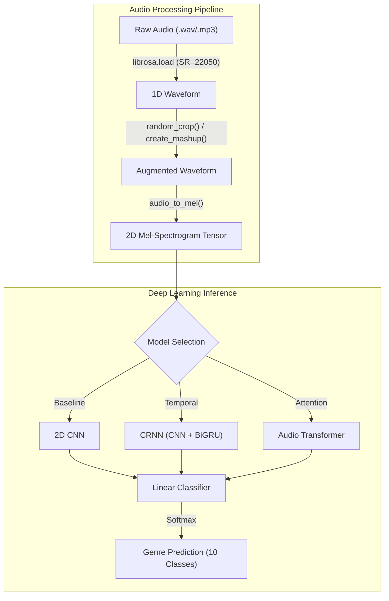

<div align="center">
  
  
  
  
  <br />
  <br />
  <h2>🎵 Deep Learning Music Genre Classifier & Mashup Analyzer</h2>
  <p><b>Advanced Audio Processing with CRNNs & Vision Transformers</b></p>
  
  [](https://huggingface.co/spaces/ghazi-r3/music-genre-classifier)
</div>

<br />

This repository contains a state-of-the-art Deep Learning pipeline for Audio Classification. Built from scratch in PyTorch, this project explores the progression of sequence-modeling architectures—from baseline Convolutional Neural Networks (CNNs) to recurrent (CRNN with BiGRUs) and attention-based (Audio Transformers) systems—to accurately classify music genres based on acoustic features.

Operating at the intersection of Digital Signal Processing (DSP) and Deep Learning, this project demonstrates end-to-end Machine Learning Engineering: from raw waveform augmentation to deploying an interactive inference space on Hugging Face.

---

## 🌟 Key Highlights & AI Engineering

For Technical Recruiters, Hiring Managers, and AI Engineers reviewing this project, here is what makes this architecture stand out:

### 1. Progressive Model Architectures (`src/models.py`)
Instead of relying on a single monolithic model, this project implements and benchmarks three distinct neural paradigms:
- **Baseline CNN (Milestone-3):** A deep 2D-CNN feature extractor utilizing `AdaptiveAvgPool2d` for spatial dimensionality reduction.
- **CRNN with BiGRU (Milestone-4):** Combines the spatial feature extraction of a CNN with a Bidirectional Gated Recurrent Unit (BiGRU) to capture the *temporal sequencing* and rhythm of the audio signal.
- **Audio Transformer (Milestone-5):** Implements a Transformer Encoder architecture (using `nn.TransformerEncoderLayer`) that applies Multi-Head Self-Attention over the audio sequence, treating mel-spectrogram time-bins as sequential tokens.

### 2. Advanced Digital Signal Processing (`src/preprocessing.py` & `src/dataset.py`)
- **Mel-Spectrogram Transformation:** Converts raw 1D audio waveforms (`librosa`) into 2D visual representations (Mel-Spectrograms), allowing Vision-based models to process sound.
- **Custom Mashup Data Augmentation:** Engineered a custom `create_mashup` pipeline to dynamically overlay audio tracks during training, forcing the model to learn robust, invariant features rather than memorizing clean tracks.
- **Stochastic Cropping:** Implemented `random_crop` to slice dynamic audio segments during `__getitem__` calls, ensuring the model generalizes across any timestamp of a song.

### 3. Production Deployment
- **Hugging Face Spaces Integration:** The final optimized model is hosted live using Gradio/Streamlit on Hugging Face. Try it here: [Music Genre Classifier](https://huggingface.co/spaces/ghazi-r3/music-genre-classifier).

---

## 🏗️ System Architecture



---

## 🚀 Getting Started

### Prerequisites
- Python 3.9+
- `torch`, `torchaudio`, `librosa`, `numpy`

### Local Execution

1. **Clone the repository:**
   ```bash
   git clone https://github.com/ghazi-r3/dl-genai-project-26-t1.git
   cd dl-genai-project-26-t1
   ```

2. **Run Training:**
   Execute the training loop which dynamically processes audio files, generates spectrograms, and updates model weights.
   ```bash
   python src/train.py
   ```

3. **Run Inference:**
   Test the model against a custom audio file.
   ```bash
   python src/inference.py --audio path/to/song.wav
   ```

---

## 💼 Why This Matters

This project serves as a showcase of core **AI/ML Engineering** competencies:
- **Audio/Speech Processing:** Demonstrated ability to bridge DSP with Neural Networks.
- **PyTorch Mastery:** Custom Dataset classes, custom model architectures, and dynamic tensor manipulations.
- **Architectural Trade-offs:** Practical understanding of when to use CNNs vs. RNNs vs. Transformers.

*Built by an AI Engineer passionate about Deep Learning, Generative AI, and elegant software architecture.*
